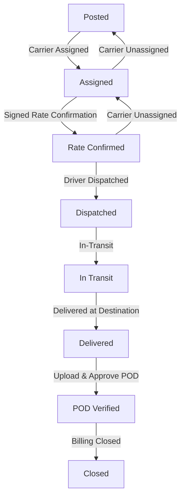

# 🚚 LoadFlow — B2B Freight Brokerage Operations Suite

LoadFlow is a production-ready, premium B2B Freight Brokerage Operations Suite designed for modern logistics managers, shippers, and carriers in India. The application integrates carrier compliance checks, dynamic freight routing, shipment timelines, audit logging, rate confirmation version controls, and executive reports in a seamless interface.

---

## 🛠️ Technology Stack

| Component | Technology | Description |
| :--- | :--- | :--- |
| **Frontend** | React, Vite, Tailwind CSS, Lucide React, Recharts, TanStack Query | Dynamic dashboard interface, charts, interactive portals, and state sync |
| **Backend** | NestJS, TypeScript, RxJS, Passport.js | Scalable API gateway, controllers, services, and validation middleware |
| **Database** | SQLite, Prisma ORM | Relational schema modeling with cascading constraints, transactions, and seeding |

---

## 📂 Repository Structure

```text
LoadFlow B2B SaaS Design/
├── src/                    # Frontend React Application source code
│   ├── app/                # Main components, views, and entry file
│   │   ├── App.tsx         # core dashboard views, portals, modals and routing
│   │   └── api/            # API queries, mutations, React-Query client hooks
├── backend/                # Backend API Gateway (NestJS)
│   ├── src/                # Controller, Service, Module layer
│   │   ├── auth/           # Authentication & scoping guards
│   │   ├── loads/          # Shipments & status transition controllers
│   │   ├── carriers/       # Carrier profile and compliance metrics
│   │   ├── shippers/       # Shipper CRUD operations
│   │   ├── rate-confirm/   # Rate confirmation versioning
│   │   ├── pod/            # Proof of Delivery attachment approvals
│   │   ├── reports/        # Executive financial reports
│   │   └── common/         # Database Prisma services and middleware
│   ├── prisma/             # Schema definitions and database seeds
├── dist/                   # Bundled production frontend output assets
└── uploads/                # Proof of Delivery and Rate Confirmation file attachments storage
```

---

## 🚀 Quick Start Guide

### Prerequisites
- Node.js (v18 or higher)
- npm or pnpm package manager

### 1. Backend Setup
First, navigate to the `backend/` directory, install packages, and set up your SQLite database:
```bash
cd backend
npm install
```

Create a `.env` file inside the `backend/` directory with the following variables:
```env
DATABASE_URL="file:./dev.db"
JWT_SECRET="loadflow-super-secret-key-123!"
PORT=3001
```

Generate the Prisma Client and run migrations to build the SQLite database tables:
```bash
npx prisma generate
npx prisma migrate dev --name init
```

Seed the database with default organizations, loads, custom roles, and team accounts:
```bash
npm run seed
```

Start the NestJS backend in development mode:
```bash
npm run start:dev
```
The API server will listen on [http://localhost:3001](http://localhost:3001).

---

### 2. Frontend Setup
In a new terminal window, navigate back to the root directory, install dependencies, and start the development server:
```bash
# In the root directory
npm install
npm run dev
```
Open [http://localhost:5173](http://localhost:5173) in your browser to interact with the application.

---

## 🧭 Main Portals & Features

### 🏢 Broker Admin Dashboard
*   **Load Board Kanban & Table Views:** Track freight statuses through the visual Kanban lanes. Filter loads dynamically by text search and status.
*   **AI Field Extractor:** Parse copy-pasted shipment text details to automatically populate the Create Load fields.
*   **Carrier Compliance Panel:** Check Department of Transportation (DOT) status, Motor Carrier (MC) status, insurance expirations, and compliance levels prior to carrier assignment.
*   **Rate Confirmation Version Control:** Generate, edit, sign, and download custom Rate Confirmations (RC) on a per-version basis.
*   **Milestone Timeline & Audit Logs:** Audit real-time changes to loads. Each event automatically adds to the shipment's historical timeline.
*   **Reports & Executive Analytics:** Run YTD or quarterly reports. Export loads or financial summaries instantly to client-side CSV files.

### 🚚 Carrier Portal
*   **Assigned Shipments:** Access assigned loads immediately.
*   **Status Machine Controls:** Update shipment status sequentially (e.g. `dispatched` -> `in-transit` -> `delivered`).
*   **Proof of Delivery (POD):** Upload delivery receipts (PDF or image formats), track approval status, and view document history.

### 🏭 Shipper Portal
*   **Tracking Hub:** Live shipment tracking with status bar updates showing exact progress percentage.
*   **Document Center:** Download associated Rate Confirmations and approved Proof of Delivery attachments directly.

---

## 🚦 Status Machine Transition Rules
The backend enforces a strict state flow checking mechanism to maintain compliance. State skips (e.g. transitioning directly from `assigned` to `dispatched` without a signed Rate Confirmation) are blocked.



---

> [!IMPORTANT]
> All financial valuations, load rates, and summary reports throughout the application are consistently modeled and displayed in Indian Rupees (₹).

> [!TIP]
> Use the **Demo Portal Selector** on login to easily jump between the Broker Dashboard, Carrier Portal, and Shipper Portal.